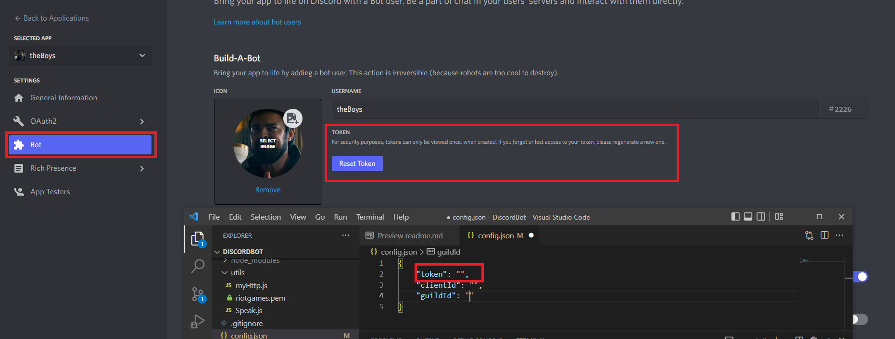
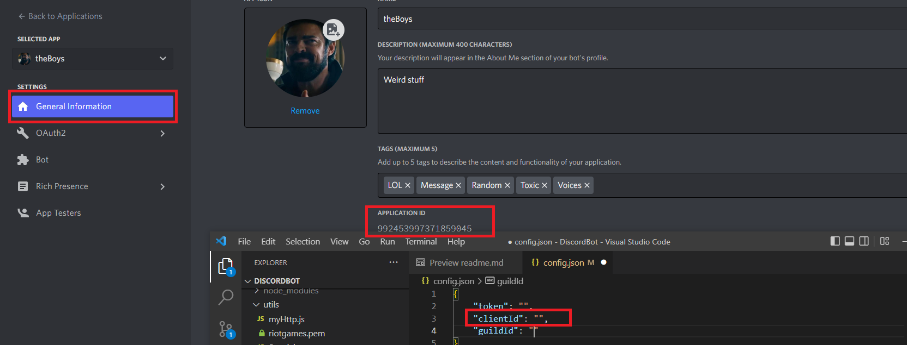

*****
<h2>Como linkear tu bot al codigo</h2>
( Una vez que te sientas comodo con el codigo del bot podes subirlo en heroku para no tener que estar levantandolo )
   

<h3> Pasos a seguir: </h3>

- Crea tu bot de discord, guia oficial de Discord.
  https://discord.com/developers/docs/intro 
- Aqui encontraras el token

- Aqui encontraras el clientId

- Finalmente activa las opciones de desarrollador en discord 
configuracion --> avanzado --> opciones de dev

-   Ya en el codigo busca por <b>config.json</b> y completa segun lo siguiente: 
    "token": "ElTokenDeTuBotDeDiscord", 
    "clientId": "ApplicationIDdeTuDiscordBot", 
    "guildId": "ClientIdDelServidorAlQueElBotSeUne"; 

- En <b>LolData.js</b> dentro de la carpeta models:  
  Cambiar el nombre de usuario por el usuario que hostea el sv y va a estar jugando la partida (username en LOL)

- Una vez completado config.json y Loldata.js:   
    --> Ejecutar en la terminal <b>npm install</b> (instalara los paquetes necesarios)  
    --> Ejecutar <b>deploy-command.js</b> (registrara los comandos)  
    --> Ejecutar <b>index.js</b> 
    --> El bot se conectara al servidor de discord y registrara  sus comandos:
    * /startGame (una vez iniciado estara escuchando y esperando a que una partida inicia para empezar a relatar)
    * extra commands /join and /leave
  
 

- Agregar comandos de voz: 
  En la siguiente pagina podras encontrar la voz que he utilizado (en este caso MarianoCloss) 
  https://fakeyou.com/

- El patron que decidi llevar es el de "ellos", "nosotros" + numeroAzar.
   Aqui un ejemplo 
  fb = firstblood 
  fbE = firstblood Ellos 
  fbN = firstblood Nosotros 

  
*****
- Para agregar nuevas interacciones, la logica es bastante simple y seguramente mejorable

-   Helpful links: 
https://developer.riotgames.com/docs/lol#game-client-api_live-client-data-api 
https://discordjs.guide/voice/audio-resources.html#creation 
https://stackoverflow.com/questions/70610280/discordjs-13-bot-not-playing-local-mp3-file

*****

 <b><h3> Pueden agregarse cuantos audios quieras. Programe el bot por diversion y espero se disfrute y funcione.   
 Tambien espero que si te gusto le des tus mejoras y lo compartas con los demas</h3></b>

